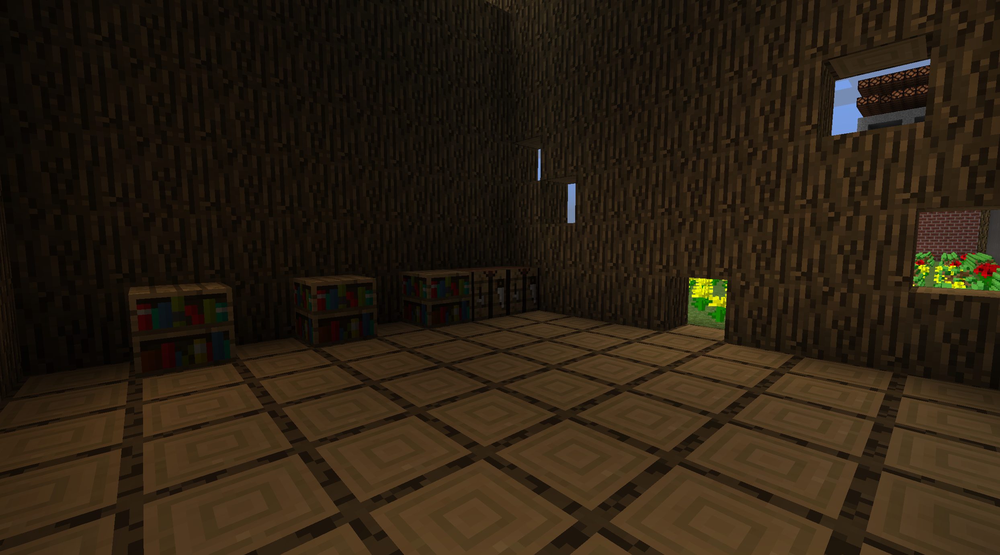
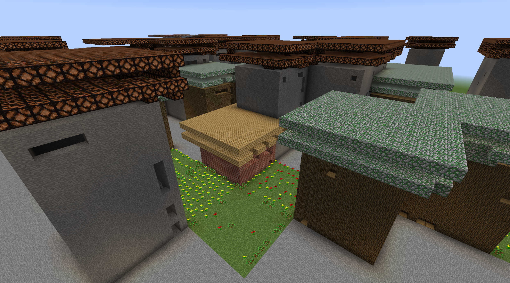

# Evocraft PCGNN


- [Evocraft PCGNN](#evocraft-pcgnn)
  - [About](#about)
  - [Code Structure.](#code-structure)
  - [How it works](#how-it-works)
  - [How to Run it](#how-to-run-it)
    - [Setup](#setup)
    - [Training](#training)
    - [Evaluation](#evaluation)
  - [Examples](#examples)
    - [Cities](#cities)
    - [Towns](#towns)
    - [More Towns](#more-towns)
- [License and Notes](#license-and-notes)
- [Acknowledgements](#acknowledgements)


<p align='center'>
  
</p>

## About
This is the repository for our submission to the [Minecraft Open-Endedness Challenge](https://evocraft.life/). We leverage [PCGNN](https://github.com/michael-Beukman/pcgnn) to create different artifacts in minecraft, and finally compose them together.

This was done by Michael Beukman, Matthew Kruger, Guy Axelrod, Manuel Fokam, Muhammad Nasir.

To run any file in this project, you must start from the root directory and run `./run.sh path/to/file`. **Do not use `python` directly**.


## Code Structure.
See the [PCGNN Repo](https://github.com/michael-Beukman/pcgnn) for more detailed information. That codebase was used as the base for this project, and some files may not strictly be necessary.
We have a collection of different "levels"
- Town: `src/games/minecraft/towns/minecraft_level_town_larger.py`
- Town: `src/games/minecraft/towns/minecraft_level_town.py`
- Roof: `src/games/minecraft/roofs/minecraft_roof_level.py`
- House: `src/games/minecraft/houses/minecraft_house_level.py`
- Garden: `src/games/minecraft/gardens/minecraft_level_garden.py`
- Decoration: `src/games/minecraft/decorations/minecraft_decoration_level.py`


And then different fitness functions, in `src/novelty_neat/fitness`. There are quite a few different ones here, as we experimented.

Finally, there are different *runs* found in `src/runs/proper_experiments/v700/vfinal`. This directory contains the actual code we run.

Results are stored in `results/experiments`.

The [Evocraft code](https://github.com/real-itu/Evocraft-py) is stored in `Evocraft-py/`

## How it works
We use the procedural content generation approach titled PCGNN (Procedural Content Generation using NEAT and Novelty Search) in this submission.
This method leverages NEAT and Novelty search to evolve "level" generators -- each network can generate multiple levels. This further uses novelty search to incentivise generators to be diverse. Finally, this uses intra-generator novelty, which incentivises the same generator to generate multiple diverse levels.

In this competition, we leverage composition.
Effectively, we have different concepts of a "level":
- House: a 3D tilemap representing empty space and "wall"
- Decorations: Filling up a 3D space using decorations
- Roof: A 3D tilemap that covers the area beneath it
- Garden: A 2D tilemap placing elements such as flowers, grass, etc.

Then, a town is then just a 2D tilemap with objects such as houses, gardens, roads, etc.

We evolve generators for each of the above (using novelty search & some type-specific feasibility fitness functions).
The final town is generated by first obtaining a 2D level from the town network; and then filling in each type using the corresponding network. For example, if the town network outputs "house" at tile (0, 0), we replace that with the 3D output of the house network.
Different networks can arbitrarily be composed, e.g. using different house networks for different houses, generating different gardens, etc.

This is open-ended, as we leverage novelty search & NEAT. Furthermore, We can extend the compositionality to e.g. create cities, which are conglomerations of towns, etc. Each artifact itself can also be extended, and generated at arbitrary size.
Finally, we can recursively apply this compositionality, by creating cities using the **same network** that generates towns. Now, however, when this network indicates a house tile, we simply build a new town there. This can further be extended to e.g. create mega-cities.
## How to Run it
### Setup
First, you can create a new environment
```
conda env create -f env.yml
```

and activate it
```
conda activate evocraft
```

Now, the training code below does not require the minecraft server to work, but the evaluation does. Please refer to the [Evocraft repository](https://github.com/real-itu/Evocraft-py) for more details (in particular [how to render minecraft](https://github.com/real-itu/Evocraft-py#4-rendering-minecraft)), but the gist is (in a separate terminal):
- `cd Evocraft-py`
- `java -jar spongevanilla-1.12.2-7.3.0.jar`

This starts the server. When it starts up, you must teleport to around `(0, 0, 0)`, using the command (type this in the server terminal while it is running) `/tp @p 0 5 0`. You can also set the gamemode to creative using `/gamemode creative`

Now, the code that is run when running `./city.sh` and `./main.sh` will actually spawn blocks in the world.
### Training
To run the training process, you can look at the code in `src/runs/proper_experiments/v700/vfinal`, each of the files in there train a network for a specific purpose. Each file also has different versions, denoted by letters.
For instance, to run the house training, version `a`, you can execute the following in a terminal window 
```bash
./run.sh src/runs/proper_experiments/v700/vfinal/vhouses_754.py a
```

You can further extend this by adding in other configurations, as desired.

### Evaluation
Then, after running the training (or without it -- we have saved many pre-run models in this repo), you can run `./main.sh` to visualise an entire town. The configuration for this is specified in `src/games/minecraft/comp/compositional_config.py`, and you can change aspects such as the size of the objects, which network versions to use, etc.

If you want to view larger cities, then run `./city.sh`

## Examples
### Cities
<p align='center'>
  
   
  
</p>

### Towns
<p align='center'>
  
  
  
</p>


<p align='center'>
  
   
  
  
</p>

### More Towns
<p align='center'>
  
   
  
  
</p>


<p align='center'>
  
   
  
  
</p>

<p align='center'>
  
   
  
  
</p>

<p align='center'>
  
   
  
  
</p>

<p align='center'>
  
   
  
  
</p>


<p align='center'>
  
   
  
  
</p>

<p align='center'>
  
   
  
  
</p>

<p align='center'>
  
   
  
  
</p>

<p align='center'>
  
   
  
  
</p>

<p align='center'>
  
   
  
  
</p>

<p align='center'>
  
   
  
  
</p>

<p align='center'>
  
   
  
  
  
</p>

<p align='center'>
  
   
  
  
  
</p>


# License and Notes
- This code is licensed according to the MIT license (similarly to the original PCGNN repo).
- The directory `Evocraft-py/` was cloned from [here](https://github.com/real-itu/Evocraft-py), and is not our code. That may have separate licenses.
# Acknowledgements
PCGNN is based on the research supported wholly by the National Research Foundation of South Africa (Grant UID 133358).
